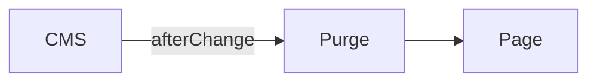
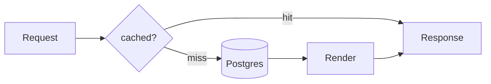

# Writing an article

The body of an article is **Markdown**. You can write it here in the panel or
paste a finished document straight in from Obsidian — it is the same format.

Everything below is what the renderer actually supports. Anything not listed
here either renders as plain text or is ignored, so there is no point reaching
for it.

---

## Text

```markdown
## A section heading
### A sub-heading

Normal prose. A blank line between paragraphs.

**bold**, *italic*, `inline code`, [a link](https://example.com).

- a bullet
- another bullet

1. a numbered item
2. the next one

> A pull quote.

---
```

Headings start at `##`. The article's title is already the `h1` on the page, so
a second one competes with it.

Every heading gets an anchor automatically, so you can link to
`/articles/my-piece#a-section-heading`.

Tables work (GitHub-flavoured):

```markdown
| Field | Type | Why |
| --- | --- | --- |
| title | text | the headline |
```

Task lists and strikethrough work too: `- [x] done`, `~~struck~~`.

**Raw HTML does not work.** It is stripped. This is deliberate — it keeps the
page safe and keeps articles looking like the rest of the site.

---

## Code

Fence it and name the language:

````markdown
```ts
export const revalidateOnChange = ({ doc }) => {
  purgeEverything()
  return doc
}
```
````

Add a filename with `title=`, which renders as a label above the block:

````markdown
```ts title="src/lib/revalidate.ts"
export const revalidateOnChange = ({ doc }) => { ... }
```
````

Highlighting happens on the server, so a code block costs the reader **no
JavaScript at all**. Common languages are available: `ts`, `tsx`, `js`, `jsx`,
`json`, `bash`, `sql`, `css`, `html`, `yaml`, `md`, `diff`, `python`, `dart`,
`kotlin`, `swift`.

A fence with no language renders as plain monospace, which is the right choice
for terminal output and log excerpts.

---

## Mermaid diagrams

Use a fence with the language `mermaid`:

````markdown

````

It renders as a real diagram, themed to match the site. Sequence diagrams, state
diagrams, ER diagrams, class diagrams and Gantt charts all work — anything
Mermaid itself supports.

Two things worth knowing:

- A diagram is the **only** thing on this site that ships JavaScript to the
  reader, and it loads only on articles that contain one. One or two diagrams in
  a piece is free in practice; fifteen is not.
- If the diagram source is invalid, the page does not break — the block renders
  as an error notice with the source visible, so you can see what to fix.

Keep diagrams narrow. A diagram wider than the text column has to scroll
sideways on a phone, which nobody does.

---

## Images and Excalidraw drawings

Two steps, always in this order:

1. **Attach the file** in the article's `Media` field (the picker under the
   body). Upload it there if it is not in the library yet.
2. **Reference it in the text** by filename, with the `media:` prefix:

```markdown

```

The text in the square brackets is the alt text. It is not decoration — it is
what a screen reader says and what shows if the image fails to load. Describe
what the image *shows*, not what it *is*: "How the token refresh works", not
"diagram".

**Excalidraw drawings are just images.** There is no special syntax. Draw it,
`File → Export image → SVG`, tick *transparent background* so it works against
the dark page, upload it, reference it exactly like above.

SVG is the right format for anything drawn (Excalidraw, diagrams, screenshots of
vector UI). PNG or JPG for photographs and screenshots of real screens.

A caption comes from the alt text automatically. If you want an image with no
caption, leave the brackets empty: ``.

An absolute URL also works — `` — but only use it for images
you do not control, since a URL can rot and a Media file cannot.

---

## The other fields

| Field | What it is for |
| --- | --- |
| **Title** | The `h1` and the browser tab. Say the specific thing, not the category. |
| **Slug** | The URL. Generated from the title; change it before publishing, never after — an old link that 404s is worse than an ugly slug. |
| **Summary** | Two or three sentences. Shown on the article list *and* used as the search-result description, so write it for someone deciding whether to click. |
| **Cover** | Optional. Used on the list card and as the social preview image. |
| **Published at** | Controls ordering and the dateline. |
| **Topics** | Short chips on the card. Two or three, lowercase, existing words — not a tagging system. |
| **SEO** | Overrides for title and description. Leave empty and the article's own title and summary are used, which is usually right. |

Reading time is calculated from the body. There is nothing to fill in.

---

## Publishing

The article is a draft until you hit **Publish changes**. Drafts autosave while
you type and are not on the public site.

Publishing purges the whole cache, so the article and the list page are live on
the next request — no waiting, no rebuild.

Unpublishing works the same way: it drops out of the list and its page 404s
immediately.

---

## A complete example

````markdown
Most of the cost was not where I expected. Here is the path a request takes
before anything is rendered:



The purge itself is one function, and it is deliberately total:

```ts title="src/lib/revalidate.ts"
const purgeEverything = () => {
  for (const tag of Object.values(TAGS)) revalidateTag(tag, 'max')
  revalidatePath('/', 'layout')
}
```

Measured over 200 requests, the miss path is the whole story:

| Path | p50 | p95 |
| --- | --- | --- |
| hit | 12ms | 28ms |
| miss | 180ms | 340ms |


````
